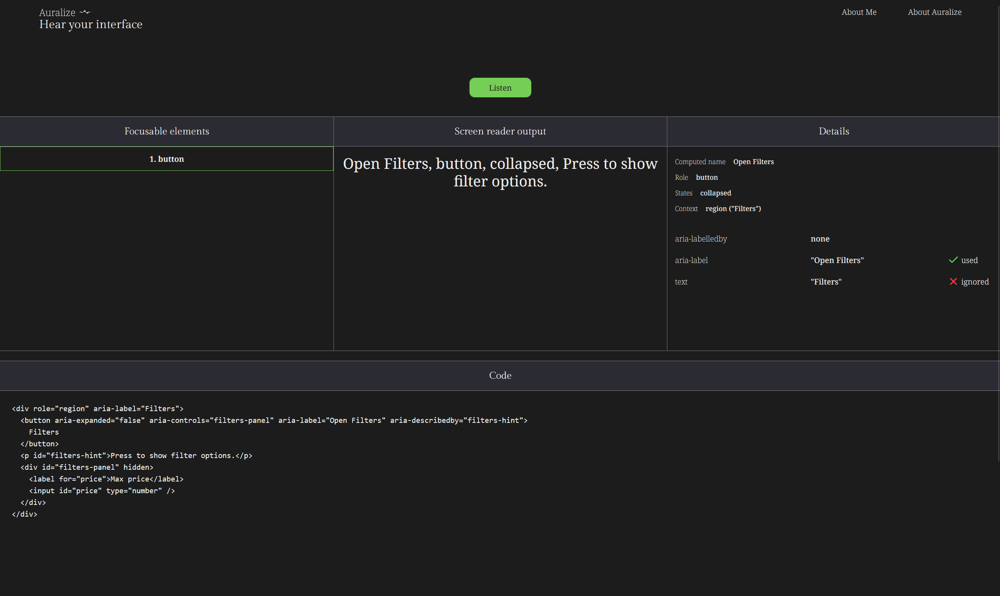

# Auralize

**Hear your interface the way users do.**  
Instant screen reader previews for accessible development.

Auralize is a developer tool that analyzes HTML and simulates how screen readers interpret:

- Accessible names
- Roles and states
- Landmark context
- Descriptions and warnings
- Realistic NVDA-style speech output
- Focus order and tab navigation

Built to make accessibility debugging **fast, visual, and understandable**.

---

## Live Demo

https://auralize-one.vercel.app/

---

## Preview



---

## Features

- Paste **HTML or JSX**
- Detect **focusable elements & tab order**
- Compute **accessible name trace**
- Show **role, states, description, and landmark context**
- Generate **screen reader preview sentence**
- Highlight **common accessibility issues**
- Minimal, dev-tools inspired UI

---

## Why this exists

While working inside an existing production project during my frontend internship,  
navigating the **accessibility tree** was harder than it should be.

I often rely on screen readers like **NVDA** to “hear” my way through interfaces.  
Auralize was created to provide that feedback **instantly**, directly from code.

The goal is simple:

> Make accessibility easier to understand, fix, and learn.

---

## Tech Stack

- **Next.js (App Router)**
- **TypeScript**
- **Tailwind CSS**
- **DOMParser-based accessibility analysis**
- **Speech Synthesis API**

---

## Getting Started

Clone the repo and run the dev server:

```bash
npm install
npm run dev
```
